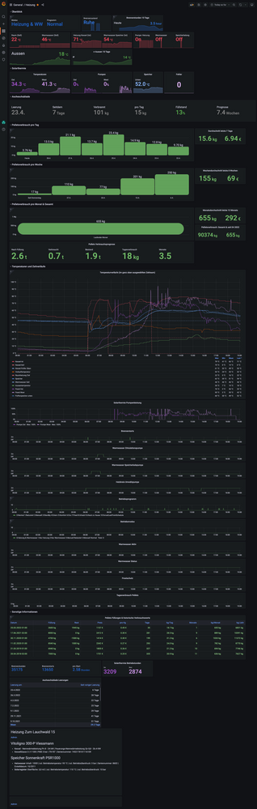

# Grafana Dashboards

## HeizungsDashboard
Retrieves heating and Solarthermie data from InfluxDB and displays them both in an integrated heating dashboard.
The specific example is configured for a Vitoligno Pellets heating but it should be possible to adjust to other heatings.

## PhotovoltaikDashboard
Retrieves PV data from InfluxDB and displays it an integrated heating dashboard.

